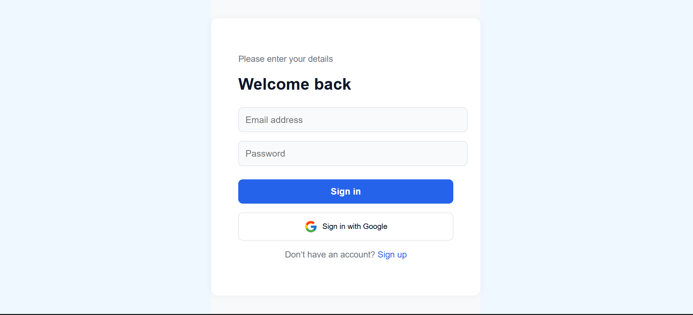

# 🚀 Google Authentication with Passport.js

A simple **Node.js** application demonstrating **Google OAuth login** using **Passport.js**.  
Users can log in with Google, manage sessions, and log out securely.  

---

## 🛠️ Tech Stack

- **Backend:** Node.js, Express  
- **Authentication:** Passport.js, express-session  
- **Database:** (if any, e.g., MongoDB)  
- **Frontend:** React (optional if you have it)  

---

## ✨ Features

- Login with **Google account**  
- User **session management**  
- Secure logout functionality  
- Minimalistic and responsive UI  

---

## 📸 Screenshots

### Signup Page


### Login Page


### Home Page


---

## ⚡ How to Run

1. Clone the repository:  
   ```bash
   git clone https://github.com/Paojangam/Authentication-Using-Google.git
   cd Authentication-Using-Google
